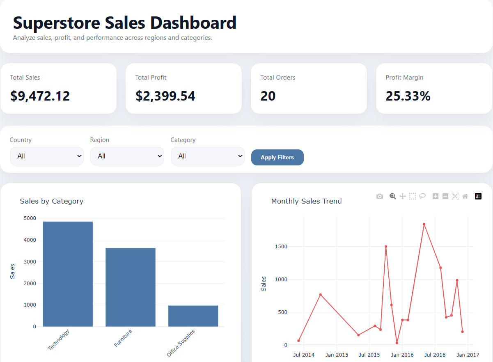
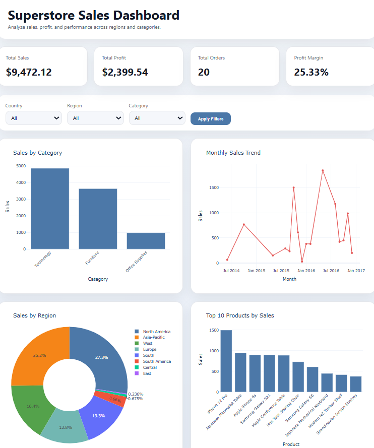
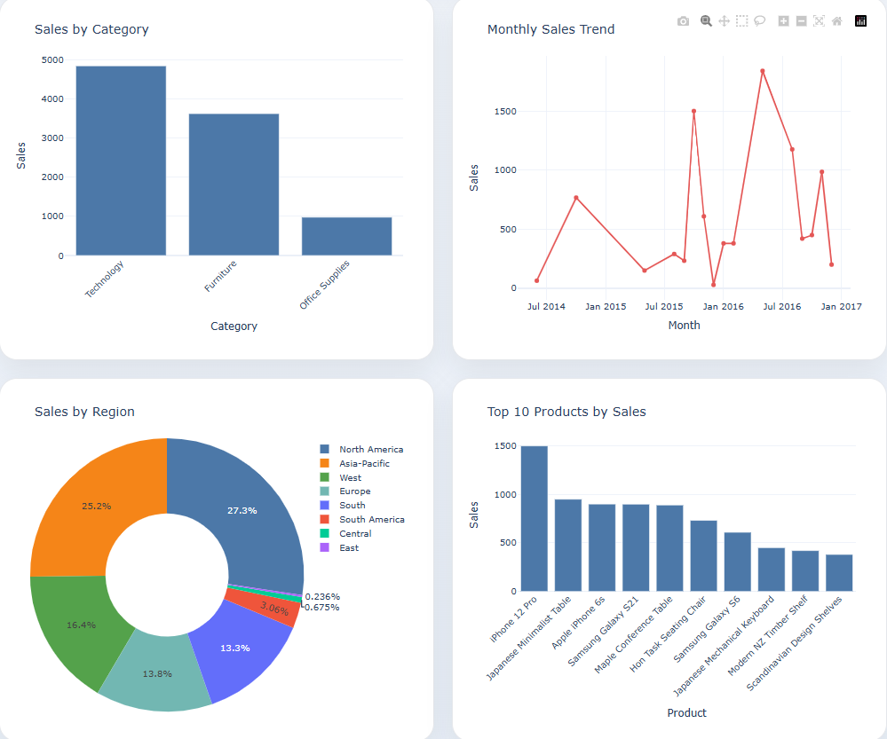
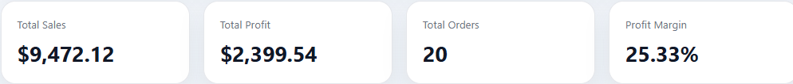

# 📊 Superstore Sales Dashboard



---

## 🚀 Project Overview
This is a **web-based Business Intelligence dashboard** built using Flask and Plotly.  
It transforms raw retail sales data into **interactive insights** to support business decision-making.

---

## ✨ Key Features

✔ Interactive Dashboard  
✔ KPI Cards (Sales, Profit, Orders, Margin)  
✔ Dynamic Charts (Bar, Line, Pie)  
✔ Data Filtering (Region, Category)  
✔ Clean & Responsive UI  

---

## 📸 Dashboard Preview

### 🔹 Main Dashboard


### 🔹 Sales Analysis


### 🔹 Profit Insights


---

## 📊 KPIs Included

- 💰 Total Sales  
- 📈 Total Profit  
- 📦 Total Orders  
- 📊 Profit Margin  

---

## 🛠️ Tech Stack

- Python  
- Flask  
- Pandas  
- Plotly  
- HTML / CSS  

---

## 📁 Project Structure

bi-dashboard/
│
├── app.py
├── data/
│ └── superstore.csv
├── templates/
│ └── index.html
├── static/
│ └── style.css
├── assets/
│ └── (screenshots here)
└── README.md

---

## ⚙️ Installation & Setup

1️⃣ Clone Repository
```bash
git clone https://github.com/your-username/your-repo-name.git

2️⃣ Navigate to Folder
cd your-repo-name

3️⃣ Install Dependencies
pip install -r requirements.txt

4️⃣ Run Application
python app.py

5️⃣ Open in Browser
http://127.0.0.1:5000/


